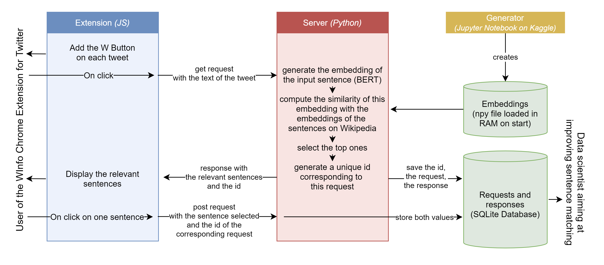

# WInfo Chrome Extension for Twitter

WInfoForTwitter is a Chrome extension that enables users to see the most relevant Wikipedia sentences related to any given tweet.

This repo contains the code for the extension and the server needed to support the Chrome extension.

Original idea by Siméon Campos and Fabien Roger.
Conception, design and development by Fabien Roger.

## What it enables you to do

When activated, the extension adds a button below each tweet.

<div align="center">
  
</div>

Clicking on it displays sentences from Wikipedia which are the most relevant to the current tweet.

<div align="center">
  
</div>

Clicking on the sentence sends you to the Wikipedia page where the sentence can be found. If you do, your choice is sent back to the server and saved to enable possible future improvements of the algorithm evaluating which sentences are the most relevant.

This could help you get more information about the current subject of your attention than a short tweet can provide, and check easily what the facts are.

## How it works

<div align="center">
  
</div>
<br>

The embeddings of the sentences are created using Hugging Face's sentence transformer named "paraphrase-MiniLM-L6-v2" which provides good sentence embeddings at a relatively low computing cost <a href="http://arxiv.org/abs/1908.10084">(Reimers 2019)</a>. It uses the average of the bert tokens of each word of the sentence weighted by the attention mask. It only supports english.

The similarity used here is the cosine similarity.

<a href="https://faiss.ai/">Faiss</a> is used to accelerate the search.

Start-of-sentences pronouns are replaced by the Wikipedia page title before generating the embeddings. I've tried using coreference resolution using neuralcoref, but it didn't provide good enough results.

## How to install the extension

1. Download the extension folder
2. Open the Chrome extension settings by typing ```chrome://extensions/``` in the search bar
3. Toggle the Developer mode, load the compressed element and select the extension folder:

<div align="center">
  
</div>
<br>
You might need to change the baseURL at the top of the content.js file in order to match the address of the server currently running the server. By default, it is set to the address it has if you run server.js locally.

## How to run the server

1. Download the server folder
2. Create an empty "server.db" file next to server.py
3. Download the embeddings and the sentences at the end of <a href="https://www.kaggle.com/fabienroger/sentences-of-wikipedia/output">this Kaggle notebook</a>. Put the ```sentences.csv``` and ```embeddings.npy``` files next to server.py
4. Run the server by running the following command:

  ```bash
  python server.py
  ```

If you want to use more up-to-date Wikipedia articles, use <a href="https://github.com/daveshap/PlainTextWikipedia">this code</a> by daveshap to create the Wikipedia dataset, then clean further and generate the sentnces and the embeddings using the code from <a href="https://www.kaggle.com/fabienroger/sentences-of-wikipedia">this Kaggle notebook</a>.

## Current limitations and possible improvements

I do not have the funding to run a permanent server to support the extension. Feel free to run it yourself if you do !

With the current state of the algorithm, it is required that all the embeddings (~20GB if you load all the dataset, ~2GB if you use the current parameters) are loaded into memory. It also requires considerable computing power : on 1 CPU, it takes a few seconds per request.

The cleaned Wikipedia dataset used here is from 2013. To make the algorithm able to deal with hot and recent topics, it would be necessary to create an updated dataset.
